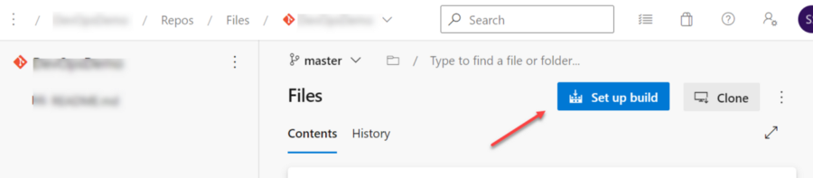
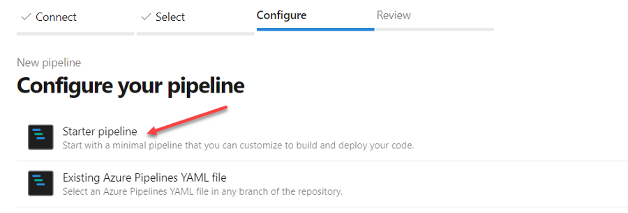
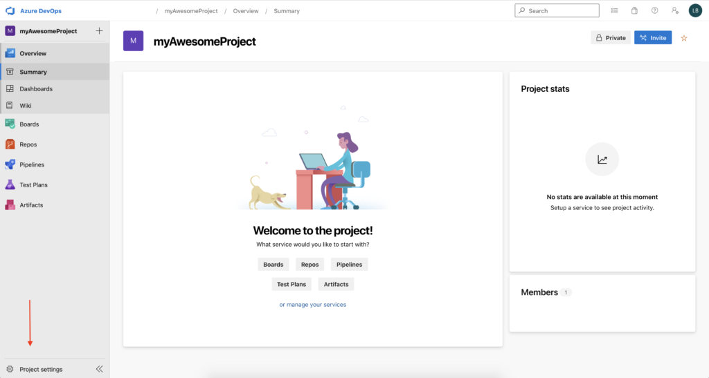
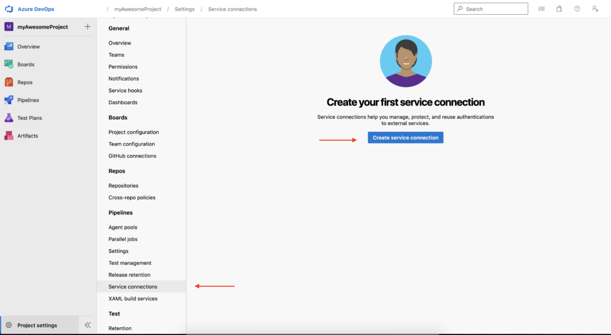
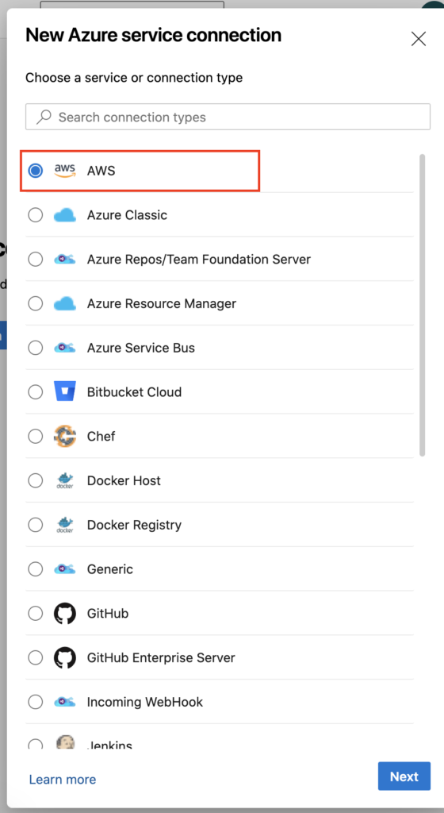
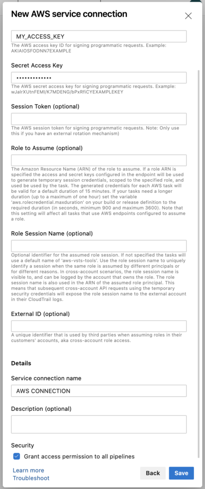

# ADO - Azure Devops

## Step 1 - Create ADO Repo

[Create a new Git repo in your project](https://docs.microsoft.com/en-us/azure/devops/repos/git/create-new-repo?view=azure-devops)

[Manage your branches](https://docs.microsoft.com/en-us/azure/devops/repos/git/manage-your-branches?view=azure-devops)

[ADO Samples](https://github.com/Microsoft/azure-devops-dotnet-samples)

## Setup 2 - Build & Test

I have committed my code in Azure DevOps Git repo as described in step 1. Now, my objective is to create a pipeline and test that my code is building and tests are passing.

Next, I started creating the pipeline using the Set up build button. This button is available in the code repository page itself.



After clicking the Set up build button, I choose the Starter Pipeline



This will create a yml file with a few basic steps. I have replaced the entire code with the below code snippet –

```yml
#This is a Build Deploy Pipeline for .NET 6 Web App to Azure App Service using Azure DevOps Pipeline

trigger:
- master
- dev

pool:
  vmImage: ubuntu-latest

variables:
  buildConfiguration: 'Release'
  dotNetFramework: 'net6.0'
  dotNetVersion: '6.0.x'
  targetRuntime: 'linux-x64'

# Build the app for .NET 6 framework
steps:
- task: UseDotNet@2
  inputs:
    version: $(dotNetVersion)
    includePreviewVersions: true
- script: dotnet build --configuration $(buildConfiguration)
  displayName: 'Build .NET 6 Application'

# Test the app for .NET 6 framework
steps:
- task: UseDotNet@2
  inputs:
    version: $(dotNetVersion)
    includePreviewVersions: true
- script: dotnet test
  displayName: 'Test .NET 6 Application'
```

## Setup 2 - Continuous Deployment with Azure DevOps Pipeline

### Azure App Service

*NOTE: To deploy the API from the Azure DevOps to Azure App Service, a Service Principal Name (SPN) is needed.*

Now that the code is building and tests are passing, we are goign to deploy our application.

```yml
#This is a Build Deploy Pipeline for .NET 6 Web App to Azure App Service using Azure DevOps Pipeline

trigger:
- master
- dev

pool:
  vmImage: ubuntu-latest

variables:
  buildConfiguration: 'Release'
  dotNetFramework: 'net6.0'
  dotNetVersion: '6.0.x'
  targetRuntime: 'linux-x64'
  azureSPNName: 'YOUR-SPN-NAME' #get it from your AzureDevOps portal
  azureAppServiceName: 'Your-Azure-AppService-Name' #get it from your Azure portal

# Build the app for .NET 6 framework
steps:
- task: UseDotNet@2
  inputs:
    version: $(dotNetVersion)
    includePreviewVersions: true
- script: dotnet build --configuration $(buildConfiguration)
  displayName: 'Build .NET 6 Application'

# Test the app for .NET 6 framework
steps:
- task: UseDotNet@2
  inputs:
    version: $(dotNetVersion)
    includePreviewVersions: true
- script: dotnet test
  displayName: 'Test .NET 6 Application'
  
# Publish it as .NET 6 self-contained application for linux runtime
- task: DotNetCoreCLI@2
  inputs:
    command: publish
    publishWebProjects: True
    arguments: '--configuration $(BuildConfiguration) --framework $(dotNetFramework) --runtime $(targetRuntime) --self-contained --output $(Build.ArtifactStagingDirectory)'
    zipAfterPublish: True

# Package the file and uploads them as an artifact of the build
- task: PublishPipelineArtifact@1
  inputs:
    targetPath: '$(Build.ArtifactStagingDirectory)' 
    artifactName: 'MinimalAPI'

#Publish it to the Azure App Service
- task: AzureWebApp@1
  inputs:
    appType: webAppLinux
    azureSubscription: $(azureSPNName) #this is the name of the SPN
    appName: $(azureAppServiceName) #App Service's unique name
    package: $(Build.ArtifactStagingDirectory)/**/*.zip
```

### Azure Function - Serverless

You'll deploy with the [Azure Function App Deploy](https://docs.microsoft.com/en-us/azure/devops/pipelines/tasks/deploy/azure-function-app) task. This task requires an Azure service connection as an input. An Azure service connection stores the credentials to connect from Azure Pipelines to Azure

```yml
trigger:
- main
- dev

variables:
  buildConfiguration: 'Release'
  dotNetFramework: 'net6.0'
  dotNetVersion: '6.0.x'
  targetRuntime: 'linux-x64'
  # Azure service connection established during pipeline creation
  azureSubscription: <Name of your Azure subscription>
  appName: <Name of the function app>
  # Agent VM image name
  vmImageName: 'ubuntu-latest'

# Build the app for .NET 6 framework
steps:
- task: UseDotNet@2
  inputs:
    version: $(dotNetVersion)
    includePreviewVersions: true
- script: dotnet build --configuration $(buildConfiguration)
  displayName: 'Build .NET 6 Application'

# Test the app for .NET 6 framework
steps:
- task: UseDotNet@2
  inputs:
    version: $(dotNetVersion)
    includePreviewVersions: true
- script: dotnet test
  displayName: 'Test .NET 6 Application'
  
# Publish it as .NET 6 self-contained application for linux runtime
- task: DotNetCoreCLI@2
  inputs:
    command: publish
    publishWebProjects: True
    arguments: '--configuration $(BuildConfiguration) --framework $(dotNetFramework) --runtime $(targetRuntime) --self-contained --output $(Build.ArtifactStagingDirectory)'
    zipAfterPublish: True

# Serverless    
- task: AzureFunctionApp@1 # Add this at the end of your file
  inputs:
    azureSubscription: <Azure service connection>
    appType: functionAppLinux # default is functionApp
    appName: $(appName)
    package: $(Build.ArtifactStagingDirectory)/**/*.zip
    #Uncomment the next lines to deploy to a deployment slot
    #Note that deployment slots is not supported for Linux Dynamic SKU
    #deployToSlotOrASE: true
    #resourceGroupName: '<Resource Group Name>'
    #slotName: '<Slot name>'
```

### Azure Container

You can automatically deploy your code to Azure Functions as a custom container after every successful build. To learn more about containers, see [Create a function on Linux using a custom container](https://docs.microsoft.com/en-us/azure/azure-functions/functions-create-function-linux-custom-image).

```yml
trigger:
- main
- dev

variables:
  # Container registry service connection established during pipeline creation
  dockerRegistryServiceConnection: <Docker registry service connection>
  imageRepository: <Name of your image repository>
  containerRegistry: <Name of the Azure container registry>
  dockerfilePath: '$(Build.SourcesDirectory)/Dockerfile'
  tag: '$(Build.BuildId)'
  
  # Agent VM image name
  vmImageName: 'ubuntu-latest'

- task: AzureFunctionAppContainer@1 # Add this at the end of your file
  inputs:
    azureSubscription: '<Azure service connection>'
    appName: '<Name of the function app>'
    imageName: $(containerRegistry)/$(imageRepository):$(tag)
```

The snippet pushes the Docker image to your Azure Container Registry. The Azure Function App on Container Deploy task pulls the appropriate Docker image corresponding to the BuildId from the repository specified, and then deploys the image.

### AWS EC2

[Instructions](https://medium.com/hashmapinc/automate-code-deployment-with-aws-ec2-build-agents-for-your-azure-devops-pipelines-6636fe1c8e21)

```yml
pool: '{name_of_your_new_pool}'
```

### AWS Lambda - Serverless

AWS Account

We need to create a [Programmatic access user](https://docs.aws.amazon.com/IAM/latest/UserGuide/id_users_create.html) that will be responsible for connecting the AWS and the Azure DevOps accounts.
For tests and only for tests you can set this permission to your user:

Policy

```json
{
    "Version": "2012-10-17",
    "Statement": [
        {
            "Effect": "Allow",
            "Action": [
                "cloudformation:DescribeChangeSet",
                "cloudformation:DescribeStackResources",
                "cloudformation:DescribeStacks",
                "cloudformation:GetTemplate",
                "cloudformation:ListStackResources",
                "cloudwatch:*",
                "cognito-identity:ListIdentityPools",
                "cognito-sync:GetCognitoEvents",
                "cognito-sync:SetCognitoEvents",
                "dynamodb:*",
                "ec2:DescribeSecurityGroups",
                "ec2:DescribeSubnets",
                "ec2:DescribeVpcs",
                "events:*",
                "iam:GetPolicy",
                "iam:GetPolicyVersion",
                "iam:GetRole",
                "iam:GetRolePolicy",
                "iam:ListAttachedRolePolicies",
                "iam:ListRolePolicies",
                "iam:ListRoles",
                "iam:PassRole",
                "iot:AttachPrincipalPolicy",
                "iot:AttachThingPrincipal",
                "iot:CreateKeysAndCertificate",
                "iot:CreatePolicy",
                "iot:CreateThing",
                "iot:CreateTopicRule",
                "iot:DescribeEndpoint",
                "iot:GetTopicRule",
                "iot:ListPolicies",
                "iot:ListThings",
                "iot:ListTopicRules",
                "iot:ReplaceTopicRule",
                "kinesis:DescribeStream",
                "kinesis:ListStreams",
                "kinesis:PutRecord",
                "kms:ListAliases",
                "lambda:*",
                "logs:*",
                "s3:*",
                "sns:ListSubscriptions",
                "sns:ListSubscriptionsByTopic",
                "sns:ListTopics",
                "sns:Publish",
                "sns:Subscribe",
                "sns:Unsubscribe",
                "sqs:ListQueues",
                "sqs:SendMessage",
                "tag:GetResources",
                "xray:PutTelemetryRecords",
                "xray:PutTraceSegments"
            ],
            "Resource": "*"
        }
    ]
}
```

With our AWS programmatic user, access key, and secret key, we can create the Azure DevOps project.

AWS Toolkit for Azure DevOps

[You can follow this link to install the tool](https://marketplace.visualstudio.com/items?itemName=AmazonWebServices.aws-vsts-tools)

Connect AWS Account to Azure DevOps



And create the service account:



AWS Service Connection:



Fill it with your AWS Credentials and add a Name:



Azure DevOps Variable Group

For this example, a variable group is necessary as we will use it to store the Lambda Function ARN, this [link](https://docs.microsoft.com/en-us/azure/devops/pipelines/library/variable-groups?view=azure-devops&tabs=classic) contains all information necessary to create and configure the group.

Code

```
git clone https://github.com/lbazetto/dotnet-core-aws-lambda-ci-cd-pipeline-azuredevops.git
```

```yml
trigger:
    - master
    - dev
    
stages:
- stage: Build
  jobs:
  - job:

    steps:
    - script: dotnet build --configuration Release
      displayName: 'dotnet build Release'

    - task: DotNetCoreCLI@2
      displayName: Run unit tests
      inputs:
        command: 'test'
        projects: '**/*Tests*.csproj'
        testRunTitle: 'Unit Tests'

    - task: DotNetCoreCLI@2
      displayName: Publish to $(Build.ArtifactStagingDirectory)
      inputs:
        command: 'publish'
        publishWebProjects: false
        projects: 'src/**/*.csproj'
        arguments: '-c Release -o "$(Build.ArtifactStagingDirectory)"'
        
    - task: PublishBuildArtifacts@1
      displayName: Publish Artifacts
      inputs:
        PathtoPublish: '$(Build.ArtifactStagingDirectory)'
        ArtifactName: 'drop'
        publishLocation: 'Container'

- stage: Deploy
  jobs: 
    - job:

      variables:
      - group: AWS-ARN

      steps:
      - task: DownloadBuildArtifacts@0
        inputs:
          buildType: 'current'
          downloadType: 'single'
          artifactName: 'drop'
          downloadPath: '$(System.ArtifactsDirectory)'

      - task: LambdaDeployFunction@1
        displayName: 'Deploy Lambda Function'
        inputs:
          awsCredentials: 'awsLambdaCICDPipeline'
          regionName: 'us-east-1'
          deploymentMode: 'codeandconfiguration'
          functionName: 'MyFunctionCreateFromAzureDevops'
          description: 'From AzureDevops'
          functionHandler: 'awsLambdaCICDPipeline::awsLambdaCICDPipeline.Function::FunctionHandler'
          runtime: 'dotnetcore2.1'
          codeLocation: 'localfile'
          localZipFile: '$(Build.ArtifactStagingDirectory)/drop/awsLambdaCICDPipeline.zip'
          roleARN: '$(AWS-Lambda-ARN)'
  dependsOn:
  - Build
  condition: and(succeeded(), eq(variables['build.sourceBranch'], 'refs/heads/master'))
```

[Reference 1](https://subhankarsarkar.com/dot-net6-azure-web-app-deployment-using-azure-devops-pipeline/)

[Reference 2](https://towardsdatascience.com/ci-cd-for-lambda-functions-with-azure-devops-and-net-core-9131b36582c0)