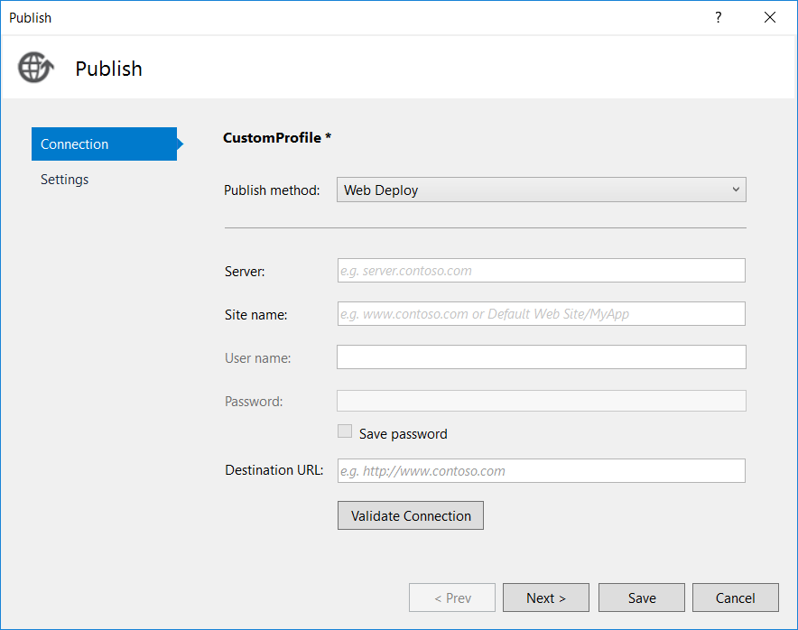
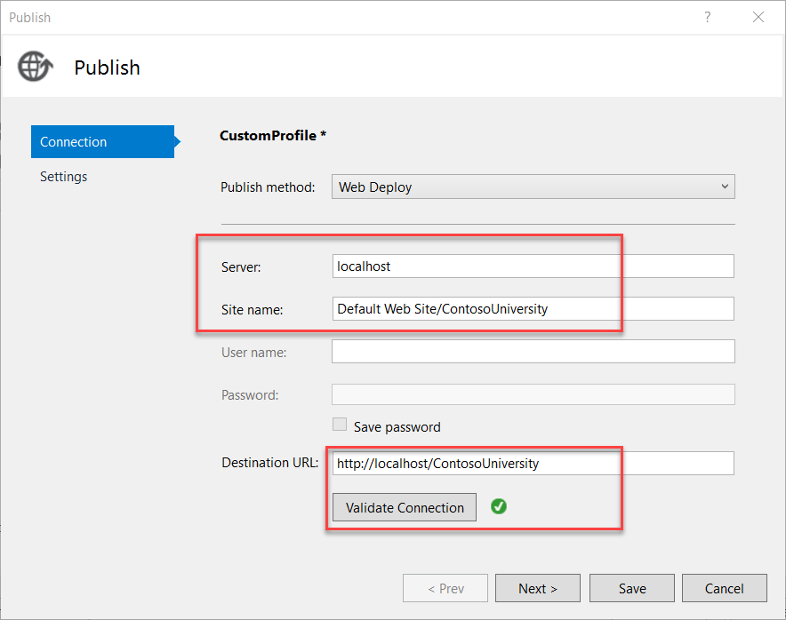
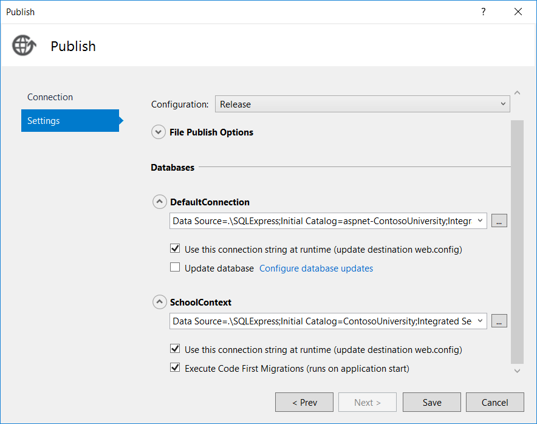
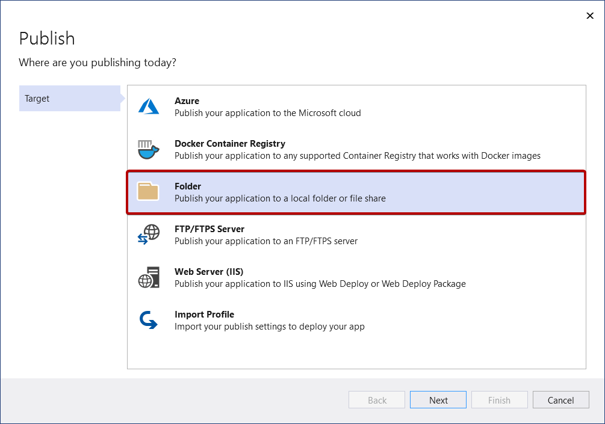

# IIS Manual Deployment 

*Not recommended - create a proper CI/CD Pipeline*

## Resources

[Deploying to IIS](https://docs.microsoft.com/en-us/aspnet/web-forms/overview/deployment/visual-studio-web-deployment/deploying-to-iis)

## Create the publish profile

- [ ] In Solution Explorer, right-click the ContosoUniversity project (not the ContosoUniversity.DAL project). Select Publish. The Publish page appears.
- [ ] Select New Profile. The Pick a publish target dialog box appears.
- [ ] Select IIS, FTP, etc. Select Create Profile. The Publish wizard appears.

- [ ] From the Publish method drop-down menu, select Web Deploy.
- [ ] For Server, enter localhost.
- [ ] For Site name, enter Default Web Site/ContosoUniversity.
- [ ] For Destination URL, enter http://localhost/ContosoUniversity.
- [ ] The Destination URL setting isn't required. When Visual Studio finishes deploying the application, it automatically opens your default browser to this URL. If you don't want the browser to open automatically after deployment, leave this box blank.
- [ ] Select Validate Connection to verify that the settings are correct and you can connect to IIS on the local computer.
- [ ] - [ ] A green check mark verifies that the connection is successful.

- [ ] Select Next to advance to the Settings tab.
- [ ] The Configuration drop-down box specifies the build configuration to deploy. Leave it set to the default value of Release. You won't be deploying Debug builds in this tutorial.
- [ ] Expand File Publish Options. Select Exclude files from the App_Data folder.
- [ ] In the test environment, the application accesses the databases that you created in the local SQL Server Express instance, not the .mdf files in the App_Data folder.
- [ ] Leave the Precompile during publishing and Remove additional files at destination check boxes cleared.

You can also Publish to Folder, then zip the folder and copy it over to the server.

*Remeber not to overide the Web.config - there might be server spesific settings. Always make a backup first before overwriting the content*

### Review the automatic Web.config

[Read more...](https://docs.microsoft.com/en-us/aspnet/web-forms/overview/deployment/visual-studio-web-deployment/deploying-to-iis)

