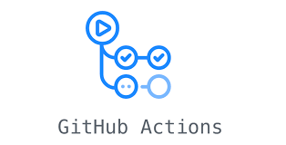

# .NET - CI/CD

## GitHub Actions
[](https://www.google.com/)

## ADO (Azure DevOps)
[](https://github.com/entelect-incubator/DevOps/tree/main/.NET/ADO)

## Manual
[](https://github.com/entelect-incubator/DevOps/tree/main/.NET/IIS)

## Performance Tips when deploying

### Performance Tips for .NET Core or .NET 6

In Startup.cs add the following

public void ConfigureServices(IServiceCollection services)

```cs
services.AddResponseCompression(options =>
{
    options.Providers.Add<BrotliCompressionProvider>();
    options.Providers.Add<GzipCompressionProvider>();
});
services.AddResponseCompression();
```

public void Configure(IApplicationBuilder app, IWebHostEnvironment env)

```cs
 app.UseResponseCompression();
```

### Security Tips for .NET Core or .NET 6

Install the follwoing Nuget Package

```
NWebsec.AspNetCore.Core
```

public void ConfigureServices(IServiceCollection services)

Configure CSP to the correct Origin

```cs
services.AddCors(options =>
{
    options.AddPolicy(
        "CorsPolicy",
        builder => builder.AllowAnyOrigin()
            .AllowAnyMethod()
            .AllowAnyHeader());
});
```

public void Configure(IApplicationBuilder app, IWebHostEnvironment env)

```cs
app.Use(async (context, next) =>
{
    if (!context.Response.Headers.ContainsKey("X-Frame-Options"))
    {
        context.Response.Headers.Add("X-Frame-Options", "SAMEORIGIN");
    }
    if (!context.Response.Headers.ContainsKey("Permissions-Policy"))
    {
        context.Response.Headers.Add("Permissions-Policy", "accelerometer=(), camera=(), geolocation=(), gyroscope=(), magnetometer=(), microphone=(), payment=(), usb=()");
    }
    if (!context.Response.Headers.ContainsKey("Feature-Policy"))
    {
        context.Response.Headers.Add("Feature-Policy", "accelerometer 'none'; camera 'none'; microphone 'none';");
    }
    await next();
});
app.UseCsp(opts => opts
    .BlockAllMixedContent()
    .StyleSources(s => s.Self())
    .StyleSources(s => s.UnsafeInline())
    .FontSources(s => s.Self())
    .FormActions(s => s.Self())
    .FrameAncestors(s => s.Self())
    .ImageSources(imageSrc => imageSrc.Self())
    .ImageSources(imageSrc => imageSrc.CustomSources("data:")));
app.UseXContentTypeOptions();
app.UseXfo(options => options.Deny());
app.UseReferrerPolicy(options => options.NoReferrer());
app.UseXXssProtection(options => options.EnabledWithBlockMode());
app.UseCors("CorsPolicy");
app.UseHsts(hsts => hsts.MaxAge(365).IncludeSubdomains());
```

### Performance Tips for .NET Framework

Response Compression add this into Web.config in <System.WebServer>

```xml
<httpCompression directory="%SystemDrive%\inetpub\temp\IIS Temporary Compressed Files">
    <scheme name="gzip" dll="%Windir%\system32\inetsrv\gzip.dll" staticCompressionLevel="9"/>
    <dynamicTypes>
    <add mimeType="text/*" enabled="true"/>
    <add mimeType="message/*" enabled="true"/>
    <add mimeType="application/x-javascript" enabled="true"/>
    <add mimeType="application/json" enabled="true"/>
    <add mimeType="*/*" enabled="false"/>
    </dynamicTypes>
    <staticTypes>
    <add mimeType="text/*" enabled="true"/>
    <add mimeType="message/*" enabled="true"/>
    <add mimeType="application/x-javascript" enabled="true"/>
    <add mimeType="application/atom+xml" enabled="true"/>
    <add mimeType="application/xaml+xml" enabled="true"/>
    <add mimeType="*/*" enabled="false"/>
    </staticTypes>
</httpCompression>
<urlCompression doStaticCompression="true" doDynamicCompression="true"/>
```

### Security Tips for .NET Framework

Basic Security add this into Web.config in <System.WebServer>

```xml
<httpProtocol>
    <customHeaders>
    <add name="Content-Security-Policy"
        value="default-src 'self' *.siteurl.co.za; connect-src 'self' localhost *.siteurl.co.za; style-src 'unsafe-inline' 'self'; script-src 'unsafe-inline' 'self'; frame-src *; img-src 'self' data:"/>
    <add name="Cache-Control" value="no-cache, no-store, must-revalidate"/>
    <add name="Pragma" value="no-cache"/>
    <add name="Strict-Transport-Security" value="max-age=31536000; includeSubdomains"/>
    <add name="X-Frame-Options" value="SAMEORIGIN"/>
    <add name="X-Xss-Protection" value="1; mode=block"/>
    <add name="X-Content-Type-Options" value="nosniff"/>
    <add name="X-Permitted-Cross-Domain-Policies" value="none"/>
    <add name="Feature-Policy"
        value="accelerometer 'none'; camera 'none'; geolocation 'none'; gyroscope 'none'; magnetometer 'none'; microphone 'none'; payment *; usb 'none'"/>
    <remove name="X-Powered-By"/>
    <remove name="X-AspNetMvc-Version"/>
    <remove name="X-AspNet-Version"/>
    </customHeaders>
</httpProtocol>
```