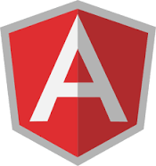

# DevOps

DevOps is a set of practices that combines software development (Dev) and IT operations (Ops). It aims to shorten the systems development life cycle and provide continuous delivery with high software quality. DevOps is complementary to Agile software development; several DevOps aspects came from the Agile methodology.

## Pre-Deployment Step 1

### Branching Strategies

[Gitflow](https://www.atlassian.com/git/tutorials/comparing-workflows/gitflow-workflow)

## Deployment Step 2 - Setup CI/CD

## .NET

## Angular

## React

## Node.js

## Post-Deployment Step 3

### Security Scan

Make sure your code is secure

[Website Vulnerability Scanner](https://pentest-tools.com/website-vulnerability-scanning/website-scanner)

### Data Integrity

Make sure to encrypt or mask any sensitive data. i.e. customer ID Number, cellphone numbers.

[Masking Data Practice](https://www.red-gate.com/hub/product-learning/data-masker/masking-data-practice?utm_source=google&utm_medium=cpc&utm_campaign=sqlprovision&utm_term=data-masking&utm_content=E-GS-DPP-Informational&gclid=Cj0KCQjwmPSSBhCNARIsAH3cYgak4I79JNa17C-kfuwHn2v_VxymmlphftKWzoetBT7o6h_GKW5WwPcaAuzUEALw_wcB&gclsrc=aw.ds)

### Run Performance Test

Smoke testing - Load testing - Stress testing - Spike testing

[Using K6 Tutorial](https://tsh.io/blog/how-to-do-performance-testing-using-k6/)